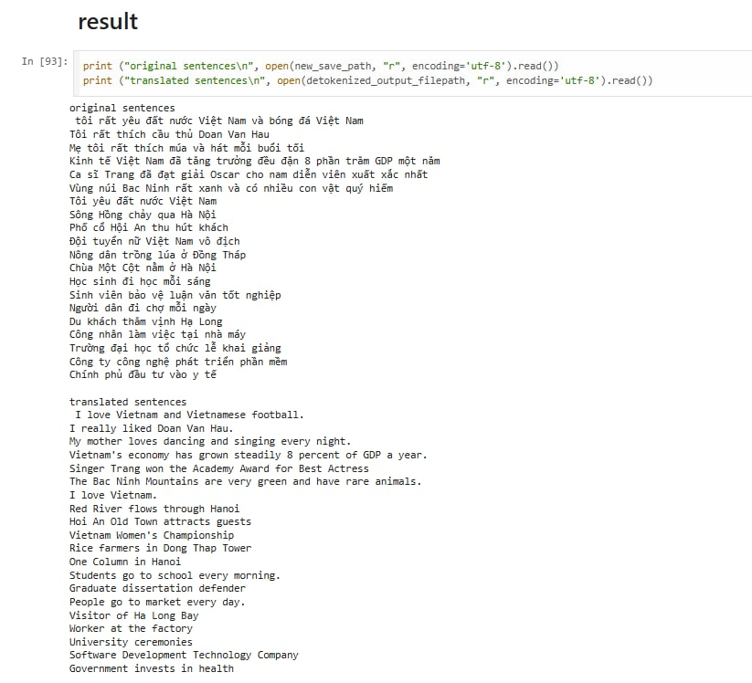

# intro
- given task of translating Vietnamese minority text to Vietnamese text (or just simply translate between any 2 language)
- According to my research, multi-language models for machine translation task rarely taken care of new unseen language , language which needs new ways to tokenize and create new vocabulary 
- luckily, framework OpenNMT-py can handle such problems by training from scratch new billigual pair of languages, also sentencepiece model from Google can handle new tokenization and vocabulary for new unseen language with ease
- so, i present to you , translate between any 2 language using OpenNMT-py framework (transformer model) with sentencepiece trained tokenizer

# demo training 
- you can read ./THE_NOTEBOOK_DEMO_FULL.ipynb
- visit ./routers/infer.py for more information of endpoints, this includes endpoint which i prepared to train new model, source tokenizer and target tokenizer


# demo inference 
- i have prepare a notebook demo to translate Vietnamese to English (to demonstrate that this model can performe well on high resource language like Vietnam and English)
- Demo usage by simply run notebook and see result in this repo : <br>[Vietnam_to_English_Translation_Demo.ipynb](https://github.com/WandererGuy/Ethnic-Minority-Machine-Translation-API/blob/main/Vietnam_to_English_Translation_Demo.ipynb)

# demo result 
in [Vietnam_to_English_Translation_Demo.ipynb](https://github.com/WandererGuy/Ethnic-Minority-Machine-Translation-API/blob/main/Vietnam_to_English_Translation_Demo.ipynb)
<div align="center">
        
</div>

# evaluation
- target: Vietnamese<br>
- source: Khmer <br>
We got result: <br>
- no bpe tokenize (better than bpe) -> Khmer to Vietnamese -> train_acc : 70%, val_acc: 39% <br>
- no bpe tokenize -> Khmer to English -> train_acc : 90%, val_acc : 63% <br>

converge at epoch 120k-140k
# medium post
https://medium.com/@manhtech264/neural-machine-translation-between-any-2-languages-part-1-74980f50e3a6

# prepare env (better to run each command)
follow these 2 files
```
0_build_spm.md
0_create_env.md
```
# run server 
```
python main.py
```
# api document 
visit ./routers/infer.py for more information of endpoints

# dockerfile
U can run a demo use Docker by simple build image with Dockerfile then run the built image 
from the repo
```
docker build  --no-cache -t nmt_main .    
docker run -it -p 5021:5021 -v D:\MANH_T04:/app/Ethnic-Minority-Machine-Translation-API/checkpoints nmt_main
```

# future work:
i have pay my attention to NLLB model from Meta , this is a tutorial for translate between any 2 language<br>
https://cointegrated.medium.com/how-to-fine-tune-a-nllb-200-model-for-translating-a-new-language-a37fc706b865
